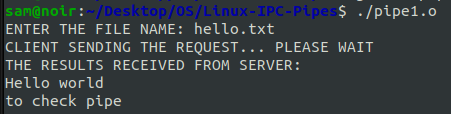
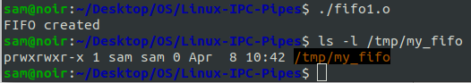

# Linux-IPC--Pipes
Linux-IPC-Pipes


# Ex03-Linux IPC - Pipes

# AIM:
To write a C program that illustrate communication between two process using unnamed and named pipes

# DESIGN STEPS:

### Step 1:

Navigate to any Linux environment installed on the system or installed inside a virtual environment like virtual box/vmware or online linux JSLinux (https://bellard.org/jslinux/vm.html?url=alpine-x86.cfg&mem=192) or docker.

### Step 2:

Write the C Program using Linux Process API - pipe(), fifo()

### Step 3:

Testing the C Program for the desired output. 

# PROGRAM:

```
Name   : Sam Israel D
Reg No : 212222230128
```

## C Program that illustrate communication between two process using unnamed pipes using Linux API system calls

```c
#include <stdio.h>
#include <stdlib.h>
#include <sys/types.h> 
#include <sys/stat.h> 
#include <string.h> 
#include <fcntl.h> 
#include <unistd.h>
#include <sys/wait.h>

void server(int, int);
void client(int, int);

int main() {
    int p1[2], p2[2], pid;
    pipe(p1);
    pipe(p2);
    pid = fork();
    if (pid == 0) {
        close(p1[1]);
        close(p2[0]);
        server(p1[0], p2[1]);
        exit(0); // Proper exit in child process
    } 
    else {
        close(p1[0]);
        close(p2[1]);
        client(p1[1], p2[0]);
        wait(NULL); // Wait for child process to terminate
    }
    return 0; 
}

void server(int rfd, int wfd) {
    int n;
    char fname[2000];
    char buff[2000];
    n = read(rfd, fname, sizeof(fname) - 1);
    fname[n] = '\0';
    int fd = open(fname, O_RDONLY);
    sleep(10);
    if (fd < 0) {
        write(wfd, "can't open", 10); // Changed size to match the message
    } 
    else {
        n = read(fd, buff, sizeof(buff));
        write(wfd, buff, n);
        close(fd); // Close file descriptor after reading
    }
    exit(0); // Exit server process after completing task
}

void client(int wfd, int rfd) {
    int n;
    char fname[2000];
    char buff[2000];
    printf("ENTER THE FILE NAME: ");
    scanf("%s", fname);
    printf("CLIENT SENDING THE REQUEST... PLEASE WAIT\n");
    write(wfd, fname, strlen(fname) + 1); // Send file name with null terminator
    sleep(10);
    n = read(rfd, buff, sizeof(buff));
    buff[n] = '\0';
    printf("THE RESULTS RECEIVED FROM SERVER:\n%s\n", buff);
}

```

## OUTPUT


## C Program that illustrate communication between two process using named pipes using Linux API system calls

```c
#include <unistd.h>
#include <stdlib.h>
#include <stdio.h>
#include <sys/types.h>
#include <sys/stat.h>
int main(){
    int res = mkfifo("/tmp/my_fifo", 0777);
    if (res == 0) printf("FIFO created\n");
    exit(EXIT_SUCCESS);
}

```


## OUTPUT


# RESULT:
The program is executed successfully.
